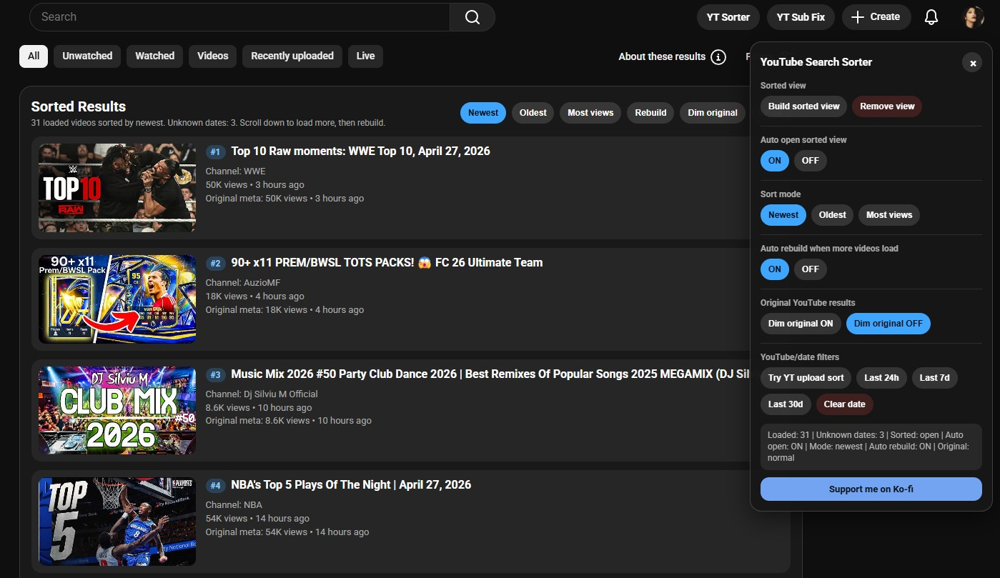

# YouTube Search Sorter

A Tampermonkey userscript that helps sort visible YouTube search results by upload date.

YouTube’s built-in **Recently uploaded** filter is often inconsistent and does not always show results in strict newest-to-oldest order. This script adds a custom **YT Sorter** button and a sorted view so you can quickly sort the currently loaded visible search results.

---

## Features

- Adds a **YT Sorter** button to the YouTube header
- Opens an in-page settings panel
- Creates a custom **Sorted View**
- Sorts visible YouTube search results by upload date
- Supports automatic sorting after enabling the sorted view
- Remembers the sorted view setting
- Includes a dimmed background mode for easier focus
- Includes a Ko-fi support button in the panel
- Works directly on YouTube search result pages
- Built for Tampermonkey userscript managers

---

## Important note

This script can only sort the YouTube results that are already loaded on the page.

YouTube loads search results gradually as you scroll. Because of that, the script cannot sort every possible search result instantly without those results being loaded first.

Recommended use:

1. Search something on YouTube.
2. Open **YT Sorter**.
3. Enable **Sorted View**.
4. Scroll down to load more videos.
5. Let the script add newly loaded videos into the sorted view.

The more you scroll, the more results YouTube loads, and the more items the sorter can organize.

---

## Screenshot

---

## Installation

### Requirements

You need a userscript manager such as:

- Tampermonkey
- Violentmonkey
- Other compatible userscript manager

### Install from GitHub

1. Open the `.user.js` file in this repository.
2. Click **Raw**.
3. Your userscript manager should detect the script.
4. Click **Install**.

### Install from Greasy Fork

If available, install it from the Greasy Fork page.

---

## How to use

1. Go to YouTube.
2. Search for something, for example: `mamamoo reaction`
3. Click the **YT Sorter** button in the YouTube header.
4. Enable the sorted view.
5. Scroll down if you want the script to collect and sort more results.

---

## How sorting works

The script reads the upload date text from visible YouTube search result cards, such as:

- `2 hours ago`
- `3 days ago`
- `1 month ago`
- `2 years ago`

Then it estimates the upload age and sorts videos from newest to oldest.

The script is designed mainly for search pages where you want newer videos first.

---

## Limitations

YouTube search pages are dynamic and lazy-loaded.

This means:

- The script cannot sort videos that YouTube has not loaded yet
- Newly loaded videos may appear only after scrolling
- Sorting depends on YouTube’s visible upload date labels
- If YouTube changes its layout, the script may need an update
- Live streams, Shorts, playlists, and unusual result cards may not always sort perfectly
- YouTube’s own filters may still behave inconsistently

---

## Known note about dim mode

The script includes a dimmed background mode.

On some YouTube layouts or with some browser extensions, dim mode may flicker or not stay applied consistently. This does not affect the main sorting feature.

---

## Recommended workflow

For best results:

1. Search on YouTube.
2. Open **YT Sorter**.
3. Enable **Sorted View**.
4. Scroll down slowly to load more results.
5. Use the sorted view to check newest videos first.

---

## Version history

## v1.0.5.

- Fixed theme styling so the sorted results panel now fits both YouTube Light Theme and Dark Theme.
- Improved the visibility of result number badges in Light Theme.
- Fixed localized metadata handling for YouTube search results where views or upload dates could appear as `unknown`.
- Added a fallback that retrieves structured YouTube video metadata when localized search result text cannot be parsed.
- Improved support for non-English YouTube interfaces by using structured publish date and view count data where available.
- Fallback publish dates are now shown in a clean `Published YYYY-MM-DD` format.

### v1.0.4

- Fixed the custom sorted results panel so it now matches both YouTube Light Theme and Dark Theme.
- Improved the visibility of the result number badges in Light Theme.

### 1.0.3

Bug fix: fixed YouTube SPA navigation issue.

Changed the userscript match pattern from:
@match https://www.youtube.com/results*

to: @match https://www.youtube.com/*

This lets the script load when YouTube is opened from the homepage, so it can detect the later search-results navigation without requiring an F5 refresh. The script still only activates its UI on /results pages via its internal isSearchPage() check.

### 1.0.2

- Added YouTube header button: **YT Sorter**
- Added in-page settings panel
- Added sorted view
- Added visible search result sorting by upload date
- Added automatic sorting behavior
- Added saved sorted view setting
- Added Ko-fi support button
- Added optional dimmed background mode

---

## Privacy

This script runs locally in your browser.

It does not collect, store, or send personal data.

Settings are saved locally through your userscript manager.

---

## Greasy Fork

[Greasy Fork script page](https://greasyfork.org/en/scripts/575816-youtube-search-sorter)

## Sponsor

